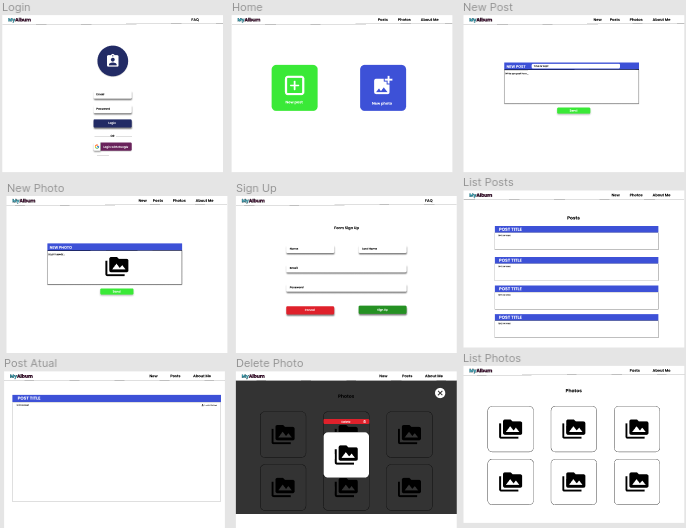

<h1 align="center">
    
</h1>

:camera: Site para postangens de fotos e  criação de posts :fax:

<h4 align="center">Status: :construction: Em produção... :construction: </h4>
 
<h2>
    :art: Layout Web
</h2>

:link: Ferramentas utilizadas
==================================
* [React](https://reactjs.org/)
* [Firebase](https://firebase.google.com/)
* [Typescript](https://www.typescriptlang.org/)